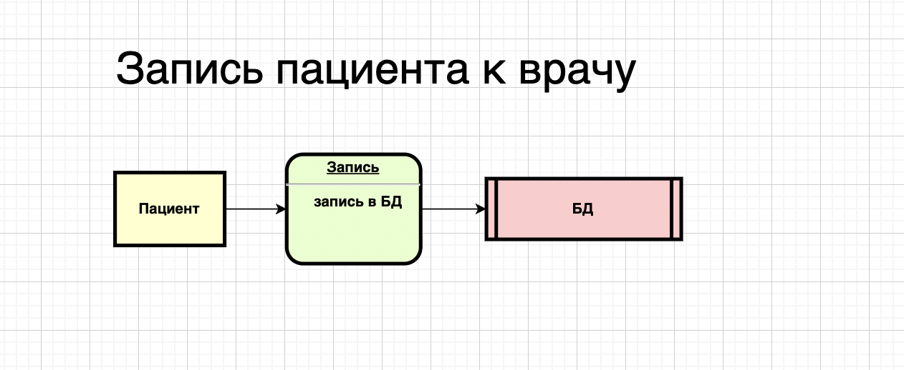
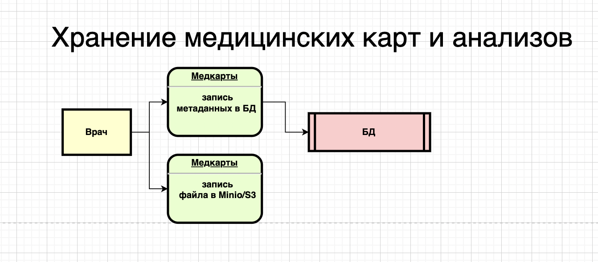
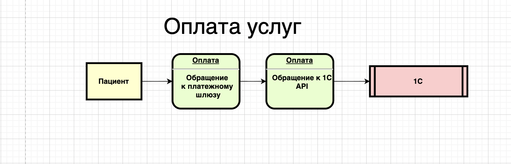
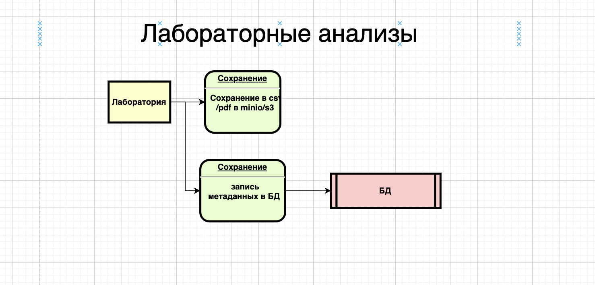

## Выявленные конфиденциальные данные

В компании используются разные носители для хранения данных, и часть информации никак не классифицируется и не защищается:

PII (персональные данные пациентов)

ФИО, дата рождения, телефон, e-mail.

Адрес проживания, место работы/учёбы.

Паспортные данные (при заключении договоров).

Медицинские данные (особая категория по 152-ФЗ)

Хронические заболевания.

Результаты анализов (Excel, PDF, JPG).

Медицинские карты, заключения врачей.

Финансовые данные

Информация о платежах (Excel, 1С, ККМ).

Данные о договорах с пациентами.

Внутренние данные компании

Кадровый учёт, зарплатные ведомости.

Учёт ТМЦ и закупок.

Внутренняя переписка (Exchange Mail).

Проблема: данные хранятся в Excel/файлах/сканах без тегирования и классификации, не разграничены по уровням конфиденциальности.

## Потоки данных (DFD — Data Flow Diagrams)

### Запись пациента на приём

Пациент → ресепшен → Excel-журнал ("Journal-Doctor-FIO").

Данные: ФИО, дата, врач.

Риски: Excel на общем диске доступен всем сотрудникам, нет аудита.

### Хранение медицинских карт и анализов

Врачи → сканы/PDF/JPG → общая папка "Pacients".

Данные: диагнозы, анализы, медицинские заключения.

Риски: общий доступ, файлы без шифрования, отсутствие контроля версий.

### Оплата услуг

Пациент → кассир → ККМ → 1С:Бухгалтерия (через TCP/IP+OLE).

Данные: суммы платежей, данные договора.

Риски: передача без шифрования, дублирование данных в Excel.

### Учёт ТМЦ

Сотрудник склада → 1С:Торговля и склад → 1С:Бухгалтерия.

Риски: данные связаны OLE, но нет разграничения доступа.

### Лабораторные анализы

Лаборатория → Excel-реестр "RegistryByDate".

Данные: ФИО пациента + результаты анализов.

Риски: пересылка Excel-файлов, возможна подмена данных.

## Аудит текущих мер безопасности

Active Directory есть, но доступ к файлам ограничивается только папками, без классификации данных.

Нет RBAC/ABAC — любой сотрудник офиса может случайно открыть файлы с анализами.

Нет аудита действий с файлами.

Данные не шифруются ни при хранении, ни при передаче.

Нет механизма удаления данных по запросу клиента (требование ФЗ-152 и GDPR).

Электронная почта (Exchange Mail) не интегрирована с системой классификации данных → риск утечек через вложения.

## Проблемные зоны

Файлы пациентов (Excel, PDF, JPG) — незащищённые, без тегов, на общем диске.

Журналы записей — ведутся вручную в Excel, доступ к файлам есть у всех сотрудников.

Интеграция с 1С — работает через небезопасный файловый режим + OLE.

Лабораторные анализы — пересылка и хранение в Excel без шифрования.

Отсутствие централизованной системы аудита — невозможно понять, кто и когда получил доступ.

Нет процессов Data Minimization — собирается больше данных, чем нужно (например, адрес работы).

Нет Privacy by Design — системы создавались без учёта защиты данных.

DFD

